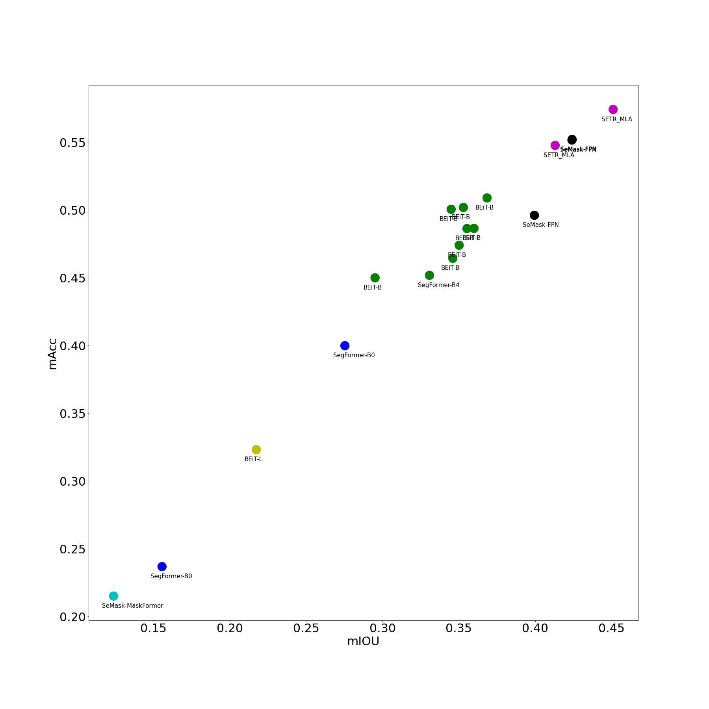

## Capstone Project 2022

### [ PIC Lab ] Computer Engineering, Chulalongkorn University

### Food Analytics : Food Image Segmentation

### by Sakon Thephamongkhol

 
This repository consists of all various revolutinary model tryouts of the food image segmentation on dataset 
<a href="https://larc.smu.edu.sg/foodseg103-benchmark-v1">FoodSeg103</a> a private datasets of <a href="https://larc.smu.edu.sg/">LARC SMU</a>

### Models include

- SegFormer B1-B5
- ConvNeXt (B)
- BEiT (B,L)
- SeMask (FPN, MaskFormer)

These are the models which performed outstandingly on famous segmentation datasets such as <a href="https://groups.csail.mit.edu/vision/datasets/ADE20K/">ADE20K</a>, <a href="https://www.cityscapes-dataset.com/">Cityscapes</a>, etc, and came out after the introduction of FoodSeg103 dataset in the paper
<a href="https://arxiv.org/pdf/2105.05409v1.pdf">A Large-Scale Benchmark for Food Image Segmentation</a>

#### This repository also includes the existing state-of-the-art models on FoodSeg103 dataset

- SETR_MLA (ViT16-B)
- Swin Transformer (B)

The performances of the models are depicted below.

